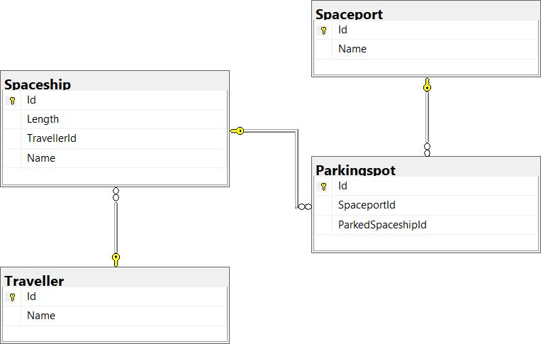

# 1. Planering och process

## Verktyg

- Discord
- Microsoft Visual Studio / Microsoft Visual Studio Code
- Github
- Github Desktop / Git Bash
- Atlassian Jira
- SQL Server Management Studio
- Docker Desktop
- Git Bash / PowerShell
- PostMan
- Typora
- Azure Potalen

## Diagram och Modeller

 

### BaseEntity

| Namn | Datatyp |
| ---- | ------- |
| Id   | int     |

### Traveller : BaseEntity

| Namn       | Datatyp         |
| ---------- | --------------- |
| Name       | string          |
| Spaceships | List&lt;Spaceship> |

### SpaceShip : BaseEntity

| Namn      | Datatyp   |
| --------- | --------- |
| Name      | string    |
| Length    | double    |
| Traveller | Traveller |

### ParkingSpot : BaseEntity

| Namn                         | Datatyp                       |
| ---------------------------- | ----------------------------- |
| SpaceshipId                  | int                           |
| Spaceport                    | Spaceport                     |
| ParkedSpaceship              | Spaceship                     |
| SpaceshipFits(double length) | bool (Method with max length) |

### Spaceport : BaseEntity

| Namn         | Datatyp           |
| ------------ | ----------------- |
| Name         | string            |
| ParkingSpots | List&lt;Parkingspot> |

## Kommunication och regler

### Arbetstimmar

Vi har varje dag samlats för att diskutera hur vi ligger till med projektet. Våra arbetstider har varit att jobba mellan KL 10:00 till KL 16:00.

### Standup

Vi valde att ha standup på måndag, onsdag och fredag.

## Regler

• Lagkamrater måste vara tillgängliga för frågor och hjälp.

• Måste försöka vara på standup-möten.

• All kommunikation sker genom Discord.

• Måste arbeta i branch, aldrig direkt på master.

• Branches måste namnges efter deras Jira nummer Ex: G6s-17-CreatetravellerDto.

• Håll gruppen informerad om du kommer att vara frånvarande.

 

## **Regler för committing kod**

• Koden måste merge genom pull request.

• Koden måste review innan den merge till master.

• Aldrig merge kod direkt för att master !!! 

• Minst 2st från gruppen måste godkänna pull request innan den merge till master.

## **Planering**

Vi valde att starta ett helt nytt projekt vi planerade att bygga backend delen och koppla det till databasen och sedan bygga frontend delen och molndelarna sist.

Vi beslutade att API:et skulle ha fyra modeller. Dessa fyra modeller är Traveller, Spaceship, Spaceport och Parkingspot. 

Frontend delen hade ingen direkt planering och ingen dokumentation. Vi kom överens i gruppen att vi skulle använda oss av Angular. Vi skissade på hur det skulle kunna se ut med vanlig HTML och CSS. Mer viste vi inte.

## Delning av arbete

### BackAPI

Vi började med att bygga vårat API och där gick det väldigt bra att dela upp arbetet i gruppen. Varje person fick göra en controller, model och repository mm. Vi började med att göra den ganska enkel för att komma igång. Det lyckades vi med väldigt bra, det gjorde att vi utökade vårat API.

### FrontEnd

När vi skulle börja med FrontEnd så blev det kaos ingen av oss hade erfarenhet eller kunskap av Angular som vi skulle använda oss av från början. Men efter att vi pratade med läraren Stephan så rekommenderade han att vi skulle använda oss av RazorPages. Eftersom vi skulle använda det på LIA så tyckte vi att det var en bra idé. Det blev svårt för oss att dela upp det eftersom vi inte hade någon erfarenhet av hur det skulle se ut. Vi satt i stort sett med hela frontend koden på varsitt håll och försökte att få igång det. Vi hade ganska bråttom att koda så dokumentationen glömde bort. Det ledde till att vi fasande i vissa moment och fick tänka om och planera på nytt. Vi gick från Angular till RazorPages till MVC Razorpages. Så vid varje byte fick vi skrota projekt och tänka om. Vi fick lägga mycket tid att läsa på varje moment. Uppdelningen här blev inte så bra så att en person pushade upp hela koden. Så allt vi höll på med och försökte hitta och fixa fick vi skrota. Detta tar vi själv klart med oss till nästa frontend projekt, då vi nu vet hur strukturen bakom det ser ut, blir det lättare att dela upp arbetet. 

Vi tog de som det kom, det är något som vi tar med oss till nästa projekt att bli bättre på.

## Azure

Azure moln tjänst gjorde vi tillsammans (Nor var våran Driver) alla var med och försökte att hjälpa till att lösa problemen som upp stod. Här hade vi 5 hjärnor och fixa detta och det gick väldigt bra alla kom med idé 

## Jira-issues
Efter varje standup så skapade vi nya Jira-issues som vi skulle börja jobba med.

[Länk till våra tidigare Jira-issues](Övrig/Jira_Issues.pdf)

Vi gjorde extra saker utanför sista sprinten och att dessa inte inkluderades i pdf filen.
En av dom är Branch: "G6S-No-Included-in-jira-issue(updated swagger with new features)" även andra små ändringar som clean code, stavninngar mm.
