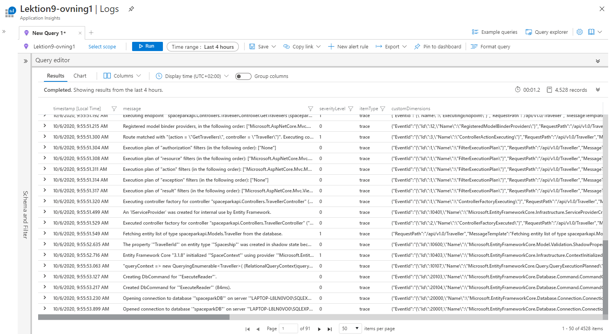

# 4. Molntjänster

## Azure SQL Server

Den tillåter oss skapa och ansluta till vår Spaceport databas, den innehåller alltså vår databas. Men för att vi ska kunna göra detta så måste vi skapa en brandväggsregel till den som ska ansluta; eftersom vår API (ACI) använde sig av databasen så behövde dens ip-adress (range) läggas till i brandväggsreglerna av SQL servern. 

## Azure SQL Database

Valde vi för det var den vi kände oss mest säkra på både med entity fremwork och med strukturen. Vi valde Code-first som länken mellan databas och kod vilket innebär att vi först skriver C#-klasser först och sedan skapar databasen baserat på dessa klasser (eller modeller). Vår connectionstring behövde sedan läggas in i vår appsettings-fil vilket kan hämtas i Azure. 

**Specs:** Region: East US, Type: Single Database, Backup storage tier: RA-GRS, Purchase model: DTU, Service tier: Basic, Performance level: B

**Pris (varje månad):** $4.90

## Azure Container Registry

Där läggs våra image upp via pipeline. Används för att lägga till och lagra våra (docker) container images, både för back- och frontend. Detta sker i pipelinen. Detta krävs för att vi ska senare publicera våra applikationer genom tjänsten Azure Container Instance i Release pipeline. 

**Specs:** Region: East US, Tier: Basic

**Pris (varje månad):** $5

## Azure Container Instance

Används för att lägga vår back- och frontend container images uppe på internet, detta gjorde vi då i våran Release pipeline. Till exempel frontend: http://spaceportdns6web.northeurope.azurecontainer.io/. Vi hade alternativet att istället använda Azure App Service för att publicera vår applikationer, detta kunde medföra olika fördelar. Jämfört med Container instance så ger App Service SSL-kryptering, bättre monitoreringsverktyg och tillgång till Azure Autoscale. Hursomhelst, App Services är dyrare att deploya jämfört med en Container Instance, och det är smidigare samt snabbare att köra mindre applikationer med Container Instance. Med tanke på dessa faktorer och att detta var ett relativt mindre projekt samt att våra credits var nästan slut så ansåg vi att en Container Instance passade bättre.

**Specs:** Region: West Europe, Operating system: Linux, Container groups: 1, Duration: 2592000, Memory: 1 GB, vCPU: 1

**Pris (varje månad):** $33.55 ($67.1 i vår fall då vi hade två ACI för back- och frontend)

## Azure Key Vault

Key Vault används för att säker hålla våran "connectionstring" till databasen hemlig och när vi skapar våra ACI i releasepipeline via Azure CLI:n (användarnamn, lösenord, loginservern etc). När du skapar ett key vault kan du ställa in vad du vill ska hållas hemligt samt välja vilken åtkomstnivå som andra  användare ska ha. Det är även viktigt att man importerar in dessa secrets när man använder de i pipeline. Detta kommer beskrivas i mer detalj under dokumentation om vår molnstruktur.

**Specs:** Region: East US, Operations (Standard or Premium): 365 `Baserat på vår totala antal av pipeline körningar där secret hämtas.`

**Pris (varje månad):** $0.03

## Application Insights

Med logger ökar säkerhet i koden och man kan ha mer kontroll vad som görs den följer varje steg och dokumenterar. Den uppdaterar också när man ändrar något.

Vi började med att lägga till Application Insights på Azure Portalen. Sen  kopierade vi ut våran "Instrumentation Key", vilket kunde hittas genom att navigera till vår Application Insights resurs i Azure. Vi angav även att vi i vårt fall ville ha en lognivå på "Trace" vilket innebärde den mest detaljerade nivå av logging. Därefter så navigerade vi till vår Application Insights resurs i Azure (Applications Insights resursen -> Monitoring -> Logs)  och nu kan vi  se ändringarna som görs. Man kan även filtrerar om man vill.

**Specs:** Type: Application Insights, Region: North Europe

**Pris (varje månad):** $0 *"Every GB of data ingested by Application Insights is retained at no charge for 90 days."* - [Källa](https://azure.microsoft.com/en-us/pricing/details/monitor/)

```c#
public static void Main(string[] args)
        {
            TelemetryConfiguration configuration = TelemetryConfiguration.CreateDefault();
            configuration.InstrumentationKey = "df48fa9f-1882-4539-8914-a1e72f6a32a1";
            var telemetryClient = new TelemetryClient(configuration);

            Log.Logger = new LoggerConfiguration()
                .MinimumLevel.Debug()
                .WriteTo.Console()
                .WriteTo.ApplicationInsights(telemetryClient, TelemetryConverter.Traces)
                .CreateLogger();

            try
            {
                Log.Information("Starting up");
                CreateHostBuilder(args).Build().Run();
            }
            catch (Exception ex)
            {
                Log.Fatal(ex, "Application start-up failed");
            }
            finally
            {
                Log.CloseAndFlush();
            }
        }
```

