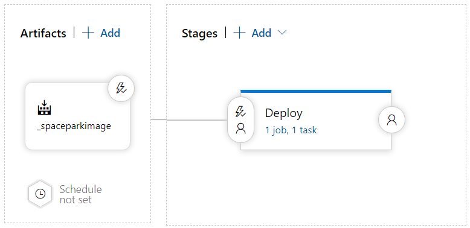
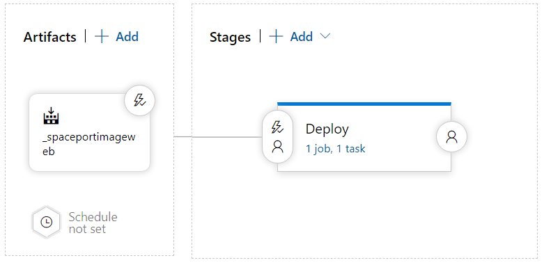

# 5. Struktur av molnet

## API och webbsidan

När koden har tryckts in i repository så distribueras webbapplikationerna automatiskt i molnet och blir tillgängliga på internet. För att detta ska vara möjligt använder vi två pipeline-filer och två docker-filer i vårt repository som Azures använder sig av. Vi använder två separata docker-filer för både front- och backend projektet. När det gäller pipeline så använder vi två separata pipeline-filer i vår repository för back- och frontend projekt. Anledningen till att vi har två separata pipeline-filer är eftersom vi inte vill att en av dessa projekt ska påverkas av den andra om något går fel. Till exempel, inte vill att hela pipeline ska misslyckas och inte deploya frontend projektet bara för att backend projektet för någon anledning misslyckas. Dessutom så har vi gjort så att backend pipeline endast "triggerar" när man gör ändringar i repositorys backend mapp (samma gäller med frontend pipeline). Detta eftersom vi inte vill att Azure ska bygga hela backend-delen bara för att vi gör någon ändring i frontend-delen till exempel.


## Separata connection strängar och API länkar

Vi använder två separata connection strängar (i respektive appsettings) beroende på vilken miljö man befinner sig i (produktions- eller utvecklingsmiljö). Om projektet befinner sig i produktionsmiljö så använder den connection strängen från Azure SQL servern och när den befinner sig i utvecklingsmiljö använder den lokala databasens connection sträng. Vi gjorde detta eftersom vi inte vill lägga till data till databasen när vi till exempel testar API:et när vi programmerar. 

De separata connection strängerna gav oss en idé hur vi kan göra liknande i frontend delen. Genom att även använda appsettings i frontend projektet kunde vi göra så att webb applikationen använder separata länkar till API:et beroende på vilken miljö den befinner sig i. Om projektet befinner sig i produktionsmiljö då använder den länken till API:et som ligger i molnet (`http://spaceportdns6.northeurope.azurecontainer.io`) och när den befinner sig i utvecklingsmiljö använder den istället länken till lokala API:et som körs (`https://localhost:44366`). Dessa länkar finns i respektive appsettings-fil i frontend projektet. Vi gjorde alltså för att vi inte vill ändra i Azure databasen (som befinner sig i produktionsmiljö) när vi vill till exempel testa olika funktioner i webbsidan.


## Backend pipelines 

### Docker-filen

[Docker-filen för API:et](../Backend/DockerFile) består av tre olika steg. I det första steget så kopierar den `SpaceParkAPI`-mappen till arbetsmappen (WORKDIR). Därefter publiceras API:et till mappen `publish`. Till slut så körs den publicerade projektet genom att använda `spaceparkapi.dll` i `publish`-mappen.

### Pipeline

[Vår pipeline fil för backend](../backend-pipeline.yml) består av fem olika uppgifter (tasks) och körs automatiskt när vi pushar backend kod. Vi försökte skapa en trigger som får pipelinen att köra endast när backend kod har pushats in. Det funkar när man pushar in kod till master-branschen men triggeras ändå när man skapar/stänger pull requests. Vi har letat efter anledningen till varför detta händer men har inte lyckats på grund av tidsbrist. En annan sak som kunde ha förbättrats är struktur av pipeline. Efter att ha sett hur Grupp 2 har delat in deras pipeline fil i olika faser (stages) som beror på varandra (`dependsOn`) , så anser vi att vår pipelines struktur kunde ha förbättrats.

Pipelinen börjar med att köra den första uppgiften som bygger API- och testprojektet. Eftersom vi vill hålla vår connection sträng hemligt så behöver vi därefter använda oss av två olika uppgifter: `AzureKeyVault@1` och `replacetokens@3` . 

````yaml
    - task: AzureKeyVault@1
      inputs:
        azureSubscription: 'myResourceGroupConnection'
        KeyVaultName: 'spaceportvault'
        SecretsFilter: 'ConnectionStrings--AppDatabase'
        RunAsPreJob: true   
    - task: replacetokens@3
      inputs:
        targetFiles: '**/*.json'
        tokenPrefix: '#{'
        tokenSuffix: '}#'
        verbosity: detailed
````

````json
{
  "Logging": {
    "LogLevel": {
      "Default": "Information",
      "Microsoft": "Warning",
      "Microsoft.Hosting.Lifetime": "Information"
    }
  },
  "AllowedHosts": "*",
  "ConnectionStrings": {
    "DefaultConnection": "#{ConnectionStrings--AppDatabase}#"
  }
}
````

Uppgiften `AzureKeyVault@1` hämtar alla secrets från vår Azure Key Vault resurs, i detta fallet behöver vi endast hämta connection strängen som ligger där. Vi använder alternativet `SecretsFilter` för att filtrera secrets som endast har namnet `ConnectionStrings--AppDatabase`. Uppgiften `replacetokens@3` söker sedan igenom projektet efter json filer och ersätter "tokens" med secret som hämtats. För att kod ska ses som en token så behöver den, enligt `tokenPrefix` och `tokenSuffix`, börja med `#{` och `}#`. Efter dessa två uppgifter är klara så blir vår token ersatt med connection strängen från Azure Key Vault.

Efter detta är klart så körs testerna. Ifall en av testerna till exempel misslyckas så kommer pipeline inte fortsätta bygga. Men annars så kommer pipeline gå vidare för att bygga och pusha API image till vår ACR (Azure Container Registry).

### Release pipeline



Efter ny version av image för API:et har pushats så kommer release pipeline att köras (genom Continuous deployment trigger). Denna release pipeline har endast en fas (stage), vilket vilket vi har kallat "Deploy". Denna fas innehåller en uppgift (task) vilket är att köra Azure CLI:n för att skapa en container instance med vår image och publicera API:et så att den finns tillgänglig på nätet. 

````bash
az container create --resource-group $(resourceGroup) --name spaceport-api --image $(loginServer)/$(imageName):$(Build.BuildId) --registry-login-server $(loginServer) --registry-username $(acrUsername) --registry-password $(acrPassword) --dns-name-label spaceportdns6 --ports 80
````

Denna uppgift använder variablar (secrets) som kommer från variabel gruppen "SpaceportVariables". Denna variabelgrupp innehåller variablar (eller rättare skrivet secrets) som hämtats från Azure Key Vault.  Variablar som hämtades var till exempel loginserver och användarnamn/lösenord till ACR. Enklast vore om vi bara hade skapat ny uppgift (task) som direkt hämtar alla secrets från Key Vault istället för att använda en variabelgrupp som i sin tur hämtar alla dessa secrets. Men detta upptäckte vi i sent skede och hade därför inte tid med att ändra.


## Frontend pipelines 

### Docker-filen

[Docker-filen för frontend](https://github.com/PGBSNH19/spacepark-grupp-6-spacepark/blob/master/BackEnd/DockerFile) består av, likt docker-filen för API:et, tre olika steg. I det första steget så kopierar den `FrontEnd`-mappen till arbetsmappen (WORKDIR). Därefter publiceras frontend projektet till mappen `publish`. Till slut så körs den publicerade projektet genom att använda `SpaceparkWebApp.dll` i `publish`-mappen.

### Pipeline

Jämfört med pipeline för backend, så är [vår pipeline fil för frontend](../frontend-pipeline.yml) betydligt mindre men ändå liknande. Den består endast av två uppgifter (tasks); `DotNetCoreCLI@2` och `Docker@2`. Uppgiften `DotNetCoreCLI@2` bygger frontend projektet och uppgiften `Docker@2` bygger samt pushar frontend image till vår ACR. 

### Release pipeline



Release pipeline för frontend är nästan exakt lika som release pipeline för backend. Den börjar med att köras efter ny image har pushats och övergår sen till "Deploy"-fasen för att skapa en Azure Container Instance för frontend. Skillnaden mellan denna release pipeline och release pipeline för backend är att denna pipeline kommer självfallet använda olika variablar i CLI:n när den skapar ACI:n, vilka är namn på ACI:n, namn på image, och dns.

````bash
az container create --resource-group $(resourceGroup) --name spaceport-web --image $(loginServer)/$(imageNameWeb):$(Build.BuildId) --registry-login-server $(loginServer) --registry-username $(acrUsername) --registry-password $(acrPassword) --dns-name-label spaceportdns6web --ports 80
````


