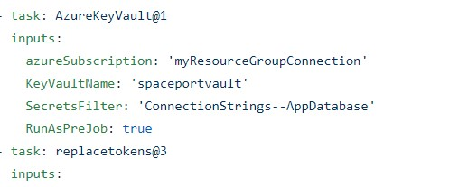
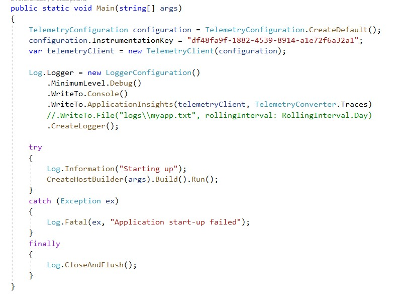

### **Molntjänster**

**Azure SQL Database**

Valde vi för det var den vi kände oss mest säkra på både med entity fremwork och med strukturen. Vi valde Code-first som länken mellan databas och kod vilket innebär att vi först skriver C#-klasser först och sedan skapar databasen baserat på dessa klasser (eller modeller). Vår connectionstring behövde sedan läggas in i vår appsettings-fil vilket kan hämtas i Azure. Vi behövde också installera följande Nuget-paketer i vår projekt.

**Azure SQL Server**

Den tillåter oss skapa och ansluta till vår Spaceport databas, den innehåller alltså vår databas. Men för att vi ska kunna göra detta så måste vi skapa en brandväggsregel till den som ska ansluta; eftersom vår API (ACI) använde sig av databasen så behövde dens ip-adress (range) läggas till i brandväggsreglerna av SQL servern. 

**Azure Container Registry**

Där läggs våra image upp via pipline. Används för att lägga till och lagra våra (docker) container images, både för back- och frontend. Detta sker i pipelinen. Detta krävs för att vi ska senare publicera våra applikationer genom tjänsten Azure Container Instance i Release pipeline. 

**Azure Container Instance**

Används för att lägga vår back- och frontend container images uppe på internet, detta gjorde vi då i våran Release pipeline. Till exempel frontend: http://spaceportdns6web.northeurope.azurecontainer.io/

**Key Vault**

Key Vault används för att säker hålla våran "connectionstring" till databasen hemlig. När du skapar ett key vault kan du ställa in vad du vill ska hållas hemligt samt välja vilken åtkomstnivå som andra  användare ska ha.

När vi implementerade Key Vault-tjänsten i vårt projekt började med att vi skapade en KeyVault i vår Resource Group i azure . Efter skapandet av vår Key Vault behöver vi lägga till en Secret och dess Value kommer att bevara vår "connectionstring" till databasen. Därefter sker allt i piplinen där filtrerar man vad man vill ha ut exempelvis: vill vi hämta ut conectionstringen så skriver man det där.

**Application insights**

Med logger ökar säkerhet i koden och man kan ha mer kontroll vad som görs den följer varje steg och dokumenterar. Den uppdaterar också när man ändrar något .

Vi började med att lägga till Application Insights på Azure Portalen. Sen  kopierade vi ut våran "Instrumentation Key", vilket kunde hittas genom att navigera till vår Application Insights resurs i Azure. Vi angav även att vi i vårt fall ville ha en lognivå på "Trace" vilket innebärde den mest detaljerade nivå av logging. Därefter så navigerade vi till vår Application Insights resurs i Azure (Applications Insights resursen -> Monitoring -> Logs)  och nu kan vi  se ändringarna som görs. Man kan även filtrerar om man vill.

### ****Sammanfattning****

Vi använde RazorPages för att bygga frontend, delvis för att en del av gruppen ska använda de på lia men också för att vi ville lära oss ett nytt sätt att hantera frontend. Detta ledde då till att frontend delen tog längre tid. Delvis eftersom vår modell måste hantera två sidor och passa runt information som våra modeller innehåll från sida till sida så att vi kan hantera skeppsparkering och checka ut skepp.

Detta blev så klart  komplicerat vi hade inte räknat med att vi skulle behöva lägga ner så mycket tid på RazorPages. Vi fick läsa på mycket på google samt kolla på youtube och många exempel gjorde inte som vi gjorde. Eftersom RazorPages tog oss mycket tid. Hade det kanske varit bättre att vi skulle hålla oss till något som vi var förstod såsom HTML och JavaScript från början, men eftersom vi kommer att använda det på lian i framtiden bestämde vi oss för att lära oss RazorPages nu.

Det vi är mest nöjda med är att RazorPages fungera normalt man kan skicka / hämta information mellan frontend och backend. Molndelen tog inte lågt tid den var väldigt smidig och snabb. Det är främst RazorPages som vi är mycket stolta över att vi lyckades med.

Hade vi haft mer tid skulle vi haft en tredje sida det hade varit snyggt och kanske göra det möjligt för användaren att kunna betala och få ett kvitto. Samt utveckla molndelen vi hade velat lägga till private link, blob storage men tiden räckte inte åt.

**Vad skulle vi gjort annorlunda**

Inte lägga mycket tid på att koda projektet. Istället fokusera på vår molnlösningen och dokumentation. Detta ledde då  till att vi inte kunde lägga till ytterligare tjänster för vår projekt i molnet. Såsom Azure Private link, blob storage eller mer dockumentation som user case. 

Hur viktigt det är med dokumentation är något vi tar med oss att man kommer mycket längre om man har en bra dokumentation från början. Vi hade behövt göra den mer precis så att vi vet redan innan vi börjar koda hur vi ska gå till vägar.  Då hade man undvikit att lägga ner tid på att planera under projektets gång.
